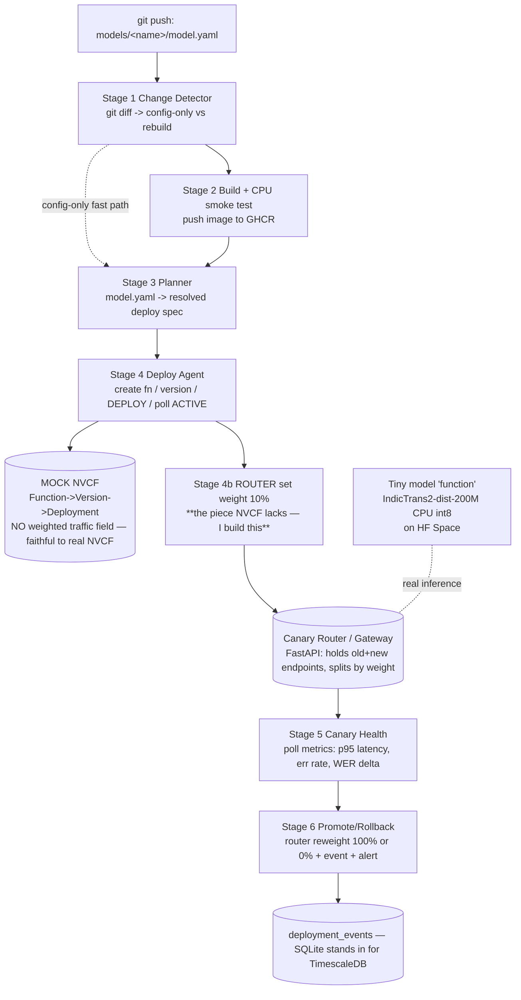
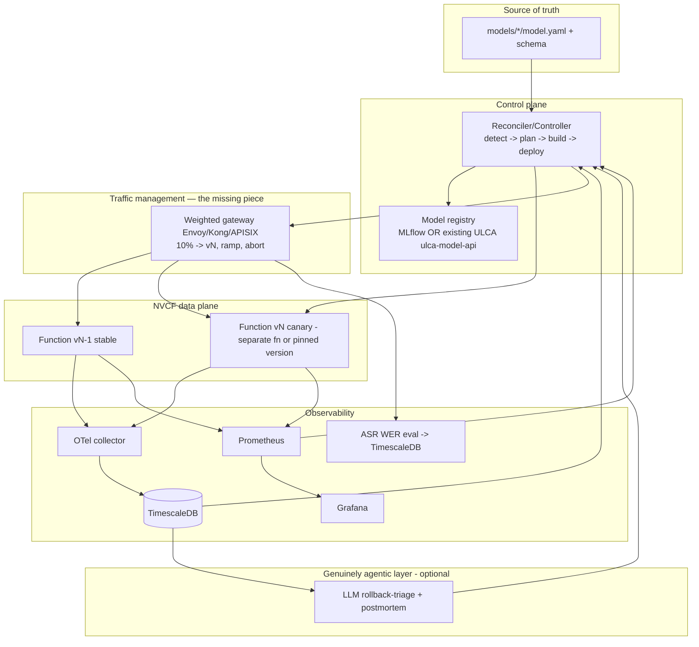

# NVCF Agentic Deployment Platform — Plan, Critique & Mentor Pack

> Author: [Intern], Week 3. Status: **research-grounded redraft** (replaces the first ACTIONABLE_PLAN draft).
> Constraints honored: no NVCF credentials, no BHASHINI internal access, theory-only background, **$0 budget**, **old i5-8th-gen-U laptop, no GPU**.
> What changed vs the first draft: I stopped treating the spec (`NVCF_Agentic_Deployment_Platform_Refactored.md`) as the source of truth and **verified its core assumptions against NVIDIA's official docs**. One assumption — the headline one — is false. Details below, with citations.
>
> **This document has four parts, as requested:**
> 1. Actionable Plan For Me (the $0 / CPU prototype I will actually build)
> 2. Improved Plan (how a senior MLOps engineer would design this for real)
> 3. Must-understand concepts / notes (so I can defend every choice)
> 4. Advice + questions for my mentor

---

## ⚠️ The one finding that reframes everything

**The spec is designed against an NVCF capability that does not exist: native, weighted, percentage-based canary traffic-splitting.**

NVIDIA Cloud Functions has a 3-layer object model — **Function → Version → Deployment**. A Function ID is a single stable endpoint; you can have multiple deployed Versions behind it. But routing across versions is **availability-based, not weight-based**:

> *"Invocations to this function ID will now be routing to both the new and old versions of the function after this deploy **based on function instance availability**."*
> *"If you do not want this to occur, for example in order to perform some testing first, **deploy a separate development function**."*
> — [NVCF Function Management docs](https://docs.nvidia.com/cloud-functions/user-guide/latest/cloud-function/function-management.html)

There is **no `trafficPercentage` / `weight` field** anywhere in the deployment API. The documented `deploymentSpecifications` fields are `gpu`, `instanceType`, `backend`, `minInstances`, `maxInstances`, `maxRequestConcurrency`, `regions`, `clusters`, `configuration`, `attributes` — none is a traffic weight. The only deployment PATCH endpoint targets GPU specs, not routing. ([Function Deployment docs](https://docs.nvidia.com/cloud-functions/user-guide/latest/cloud-function/function-deployment.html), [API reference](https://docs.nvidia.com/nvcf/api))

**Consequences for the spec (§4.5–§4.7):**
- The spec's `PATCH /versions/{vid} → trafficPercentage: 10/100/0` calls are **fictional**. Stage 4's "set traffic split" and Stage 6's promote/rollback "traffic weight swap" cannot be done with one NVCF call.
- **Real canary on NVCF = you build/operate an external router** (your own gateway that holds two function endpoints and splits by weight), OR run a separate "dev" function and cut over. The weighting logic lives in *your* code, not NVCF.
- The spec's own §9 Risk Register already half-suspected this ("NVCF API does not support traffic split… fallback: two separate functions with DNS swap"). The research **confirms the risk is real**, and DNS-swap is a poor mechanism (TTL/connection-reuse lag) — an explicit gateway is better.

Everything below is written with this corrected reality.

---

# PART 1 — ACTIONABLE PLAN FOR ME ($0 / CPU prototype)

## 1.1 Executive summary
I will build a CPU-only, $0 prototype that demonstrates the *full* deployment-automation loop **honestly**: a declarative `model.yaml` in git triggers a pipeline that deploys a real tiny BHASHINI model (IndicTrans2-distilled-200M) to a **mock NVCF** that faithfully mimics NVCF's *real* Function→Version→Deployment model — **including its limitation** that canary must be done by an **external router I build**, not by NVCF. All compute runs on free cloud (Codespaces + Hugging Face Spaces); my laptop only edits code and pushes to GitHub.

## 1.2 Direct answers to the 5 required questions (now fact-checked)
1. **Public BHASHINI model to prototype with?** Yes — **`ai4bharat/indictrans2-en-indic-dist-200M`** from Hugging Face (MIT license, ~200M params). Ships **pre-converted CTranslate2 directories** in the [IndicTrans2 repo](https://github.com/AI4Bharat/IndicTrans2) for int8 CPU inference (~sub-GB RAM — fits a 2-vCPU free box). ⚠️ `IndicTransToolkit` is **Linux/macOS only** — so I run it in Codespaces/WSL/Colab, never native Windows.
2. **Free NVCF tier for a student?** **No** — there is **no free tier to create/deploy your own NVCF function**. NVCF billing is consumption-based against prepurchased NVIDIA credits or a DGX Cloud subscription. `build.nvidia.com` free credits only let you **call NVIDIA-hosted NIMs**, not create functions. NGC is free only for *pulling* `nvcr.io` base images. → **I must mock the NVCF control plane.** ([NVCF service terms](https://www.nvidia.com/en-us/agreements/cloud-services/service-specific-terms-for-nvcf-service/))
3. **Current manual pipeline?** Human-driven, MLOps Level 0→1: build image → push to nvcr.io → click through NVCF UI to create function/version, set GPU/ports/scaling → deploy, watch until ACTIVE → manual smoke test → 100% traffic immediately, no canary, no auto-rollback. (Reverse-engineered from spec §2.1 + repo evidence: Jenkins CI badges, Voicera already calling NVCF Triton via gRPC, config living in the UI not git.)
4. **Where does the agent slot in?** Between *git commit* and *live function* — `model.yaml` replaces UI config; the pipeline drives the NVCF REST API (and the external router) instead of a human.
5. **Phases zero→prototype?** §1.4 below.

## 1.3 Architecture (corrected)

The **router (GW)** is the honest addition the original spec was missing. It is also the single most valuable thing I'll learn to build, because it's exactly what a real NVCF canary needs.

## 1.4 Implementation phases
> Calendar: **Day 1 = Phases 0–4** (push `model.yaml` → version ACTIVE on mock, real model serving). **Day 2 = Phases 5–7** (router + canary + auto-rollback + CI). Effort = beginner **+ heavy AI assistance**.

**Phase 0 — Free-cloud env (0.25d).** Public GitHub repo `bhashini-nvcf-agentic`; open in **Codespaces** (Docker works inside it); free **Hugging Face** + **NGC** accounts. `pip install fastapi uvicorn httpx pydantic jsonschema pyyaml gitpython ctranslate2 transformers sentencepiece`.
*Success:* `docker run hello-world` works in Codespaces. *[ASSUMPTION: Codespaces free core-hours suffice for 2 days — verify current quota.]*

**Phase 1 — `model.yaml` + JSON Schema (0.25d).** Repo layout per spec §5; write `models/en-hi-indictrans/model.yaml` (add `type: hf-mt` for the CPU prototype) + `pipeline/schemas/model_yaml_v1.json` + `validate.py`.
*Success:* valid yaml passes, broken yaml fails clearly.

**Phase 2 — Mock NVCF, faithful to the REAL model (0.5d).** FastAPI mock with the **3-layer** model and the **correct endpoints**: `POST /v2/nvcf/functions`, `POST /v2/nvcf/functions/{id}/versions`, and crucially the *separate* deployment plane `POST|GET|PUT|DELETE /v2/nvcf/deployments/functions/{fid}/versions/{vid}`. Versions flip `DEPLOYING→ACTIVE` after N seconds to mimic polling. **Deliberately NO traffic-weight field** — so the prototype teaches the real constraint.
*Success:* create fn → create version → deploy → poll ACTIVE → undeploy, all correct JSON.

**Phase 3 — Real tiny model "function" (0.5d).** IndicTrans2-dist-200M → CTranslate2 int8; `server.py` (FastAPI `POST /infer`, `GET /health`); Dockerfile (CPU); host as a **Hugging Face Space (Docker SDK, free CPU 2 vCPU/16 GB)** → public URL = the "deployed function." (Fallback model: `Helsinki-NLP/opus-mt-en-hi`.)
*Success:* `curl <space>/infer -d '{"text":"hello","tgt_lang":"hin_Deva"}'` returns Hindi in ~1 s.

**Phase 4 — Core agents: detect + plan + deploy (0.75d).** `change_detector.py` (git diff → `deployment_manifest.json`), `deployment_planner.py` (resolve `${GIT_SHA}`, per-model `asyncio`), `nvcf_deploy.py` (httpx → mock: create-or-version, deploy, poll ACTIVE 10-min timeout).
*Success:* editing `model.yaml` + running the 3 agents yields an ACTIVE version on the mock; config-only edit skips build.

**Phase 5 — Canary ROUTER + Health agent (0.75d) — the differentiator, done honestly.** Build `router/gateway.py` (FastAPI) that holds old+new endpoints and splits requests by a settable weight (this is the NVCF-missing piece). `canary_health.py` polls metrics (p95 latency, error rate, WER delta — WER optional, skip for NMT/TTS per spec §4.6) for `promote_after` seconds against `model.yaml` thresholds. A metrics-injector forces healthy/degraded runs.
*Success:* good metrics → router goes 100% new; injected bad metrics → router back to 0% new in <30 s; `deployment_events` row written (SQLite).

**Phase 6 — Promote/Rollback + orchestrator + GitHub Actions (0.5d).** `promote.py` (router reweight + event + console/Slack-webhook alert); `orchestrator.py` (`detect|build|deploy|verify|promote`); `.github/workflows/deploy.yml` (push to `models/**`, `fetch-depth:0`) and `hotfix_deploy.yml` (`workflow_dispatch`, `skip_canary`). Mock + router + injector run as CI steps. Tests: `test_change_detector.py`, `test_nvcf_deploy.py` (mocked).
*Success:* a push runs the Action green end-to-end and prints promote (or rollback under injected bad metrics); hotfix runs on manual dispatch.

**Phase 7 — Stretch (0.5d, optional).** Tiny status page over `deployment_events`; README + architecture screenshot; 2-min demo GIF; a paragraph documenting "what changes mock→real NVCF = base URL + auth header + the router becomes a real gateway."

## 1.5 Free-tier substitution table (what stands in for what)
| Spec assumes | I substitute ($0) | Why honest |
|---|---|---|
| Real NVCF function deploy | **Mock NVCF** (faithful 3-layer API) | No free tier to deploy a real function |
| NVCF traffic-split (doesn't exist) | **External FastAPI router** | This is *literally* how real NVCF canary must work |
| nvcr.io image push | **GHCR** (`ghcr.io`, free) | No `NVCR_TOKEN`; swap is 1 line |
| GPU Triton/vLLM serving | **CTranslate2 int8 on CPU** | 200M model fits 2 vCPU |
| TimescaleDB + OTel | **SQLite** + injected metrics | Zero-setup; same schema (spec §7.1) |
| Build/run compute | **Codespaces + HF Spaces** | Laptop has no GPU and is weak |

*[ASSUMPTION] all free-tier limits below should be re-checked at signup — they change. [NEEDS MENTOR] items in Part 4.*

---

# PART 2 — IMPROVED PLAN (how I'd design it if I were the senior MLOps/LLMOps lead)

> This is the "what it should actually be" version — what I'd propose if budget and access were not the constraint. It fixes three things the spec gets wrong and keeps the (genuinely good) parts.

## 2.1 What the spec gets RIGHT (keep these)
- **Declarative `model.yaml` in git as the single source of truth.** This is correct and is the core of GitOps. Keep it verbatim.
- **Config-only fast path** (skip rebuild when only scaling/params change). Good instinct, mirrors real CD.
- **Version-based rollback, not redeploy.** Correct in principle (rollback should be a routing change, seconds not minutes).
- **Metric-gated promotion** (don't promote on bad p95/error/WER). Correct philosophy.
- **WER-delta gate for ASR.** Genuinely Bhashini-specific and valuable — most generic tools don't have this.

## 2.2 What the spec gets WRONG (fix these)
1. **It assumes NVCF native canary.** It doesn't exist (Part 0). **Fix:** make the **traffic router a first-class platform component**, not an afterthought. Either (a) put all NVCF functions behind a managed gateway (Envoy/Kong/NGINX/APISIX) that does weighted routing, or (b) standardize on "deploy-as-separate-function + gateway cutover." Define rollback as "router reweight / re-point," explicitly.
2. **"Agentic" is a misnomer.** Stages 1–6 are **deterministic sequential CI stages** — there is no LLM, no autonomy, no reasoning under uncertainty. Calling them "agents" is branding that a senior reviewer will flag. **Two honest options:**
   - **(a) Drop the word** and call it what it is: a *declarative model-deployment controller / pipeline*. Cleaner, defensible.
   - **(b) Earn the word** by adding a genuinely agentic layer — e.g., an **LLM-based rollback triage agent** that, on a failed canary, reads the metrics + recent diffs + logs and produces a root-cause hypothesis + drafts the incident note + suggests a threshold adjustment. *That* is agentic. The deploy plumbing should stay deterministic.
3. **It reinvents progressive delivery from scratch in Python.** Argo Rollouts / Flagger already do "canary with Prometheus metric gates + automatic rollback" as mature, tested controllers; KServe does canary-by-traffic-percentage for model servers natively. **The honest catch:** those are **Kubernetes-native** and assume *you* control the cluster. **NVCF is serverless — you don't.** So you genuinely *cannot* drop in Flagger on NVCF; that's *why* a custom router is justified here. **But** the platform should still **borrow their proven design** (analysis windows, step weights, metric providers, automatic abort) rather than invent ad-hoc logic.

## 2.3 Target architecture (production-honest)

## 2.4 Build sequencing that de-risks the unknowns FIRST
A senior plan front-loads the riskiest assumption. The spec puts canary in Week 4 — too late.
1. **Spike 0 (½ day): prove the canary mechanism.** Before anything else, confirm exactly how traffic is split on NVCF (gateway vs separate functions) with NVIDIA support. This is the project's biggest risk; resolve it on day one. *(My prototype already de-risks this conceptually by building the router.)*
2. **Registry decision.** MLflow vs extend ULCA `ulca-model-api`. Decides the whole control-plane API.
3. Then build deploy → router → metric gates → rollback, reusing Argo-Rollouts/Flagger *design patterns* even though the tools themselves can't run on NVCF.
4. Add the LLM triage layer last, only if "agentic" must be literal.

## 2.5 Tooling recommendation (grounded)
- **GitOps/declarative:** keep `model.yaml`; validate with JSON Schema in CI. (Argo CD/Flux are the k8s-native references for *why* this pattern is right.)
- **Progressive delivery:** can't use Flagger/Argo Rollouts on NVCF directly → **custom router** is justified, but copy their **analysis-template** concept (metric query + interval + threshold + step weights + max failures → auto-abort).
- **Serving:** NVCF + Triton/NIM for GPU; the model card decides runtime (spec's "build once, deploy many" is right).
- **Observability:** OTel → TimescaleDB (already Bhashini's) + Prometheus/Grafana for real-time; Langfuse only if/when LLM/RAG layers are in scope.
- *[NEEDS MENTOR: confirm whether canary will be gateway-based or separate-function-based — this is the single biggest architecture fork.]*

---

# PART 3 — MUST-UNDERSTAND CONCEPTS / NOTES (so I can defend every choice)

**About NVCF (the platform this is all built on):**
- **Three layers: Function → Version → Deployment.** A *Version* (image + config) exists but serves **zero** traffic until a *Deployment* allocates GPU instances to it. The deployment API is a *separate* path: `/v2/nvcf/deployments/functions/{fid}/versions/{vid}` (POST/GET/PUT/DELETE by method).
- **Two hosts:** control plane = `api.ngc.nvidia.com`; invocation = `api.nvcf.nvidia.com`. Auth = NGC API key / bearer token, with **scopes** (`deploy_function` to manage, `invoke_function` to call).
- **No weighted canary.** (Part 0.) Multi-version routing is **availability-based**. A/B is mentioned but is *not* a settable percentage.
- **Invoke semantics:** call blocks ~5 s, else returns **202 + request-id to poll**; **302** = result too large, fetch from `Location`; supports HTTP polling, HTTP streaming, gRPC; **scale-to-zero** with no cold-boot surcharge.
- **Artifacts must live in your NGC private registry** before a function can use them; containers pulled at runtime from `nvcr.io`.

**About the MLOps ideas in the spec:**
- **GitOps** = the desired state lives in git (the `model.yaml`); a controller continuously reconciles reality to match. This is why "UI is never the source of truth" is correct.
- **Progressive delivery / canary** = release to a small % first, watch metrics, ramp or abort. **Argo Rollouts** and **Flagger** are the standard k8s tools; **KServe** does canary traffic % for model servers. They all need a service mesh / ingress that *can* weight traffic — which NVCF lacks, hence the router.
- **The metrics that gate a release:** **p95 TTFT** (time-to-first-token / first-byte latency), **error rate** (5xx), and for ASR **WER delta** (word-error-rate regression vs baseline). TTFT matters most for streaming/LLM/TTS UX.
- **"Agentic" vs "pipeline":** an *agent* reasons and acts under uncertainty (usually an LLM with tools); a *pipeline stage* runs fixed logic. The spec's stages are pipeline stages. Know this distinction cold — it's the most likely thing a senior will probe.
- **Rollback should be a routing change, not a rebuild.** Correct. But on NVCF that routing change happens in *your gateway*, not via an NVCF traffic call.

**About the models (so the demo is credible):**
- **IndicTrans2-dist-200M**: MIT, ~200M params, ships **pre-converted CTranslate2** dirs; int8 CPU inference ~sub-GB RAM; language codes are **FLORES** (`eng_Latn`, `hin_Deva`). `IndicTransToolkit` is **Linux/macOS only** (Windows → Codespaces/WSL/Colab).
- **BHASHINI Dhruva public API** is free for students: register on ULCA → generate key (max 5) → **two-step call**: ULCA *pipeline config* call returns a `callbackURL` + `inferenceApiKey`, then *compute* call to `dhruva-api.bhashini.gov.in`. Tasks: ASR/NMT/TTS, chainable. **Never hardcode keys.**

**Gotchas I will hit:**
- Native Windows can't run IndicTransToolkit → use the cloud box.
- int8 quantization can drop a few BLEU — benchmark `int8` vs `int8_float32` before claiming quality.
- HF Spaces free CPU **sleeps when idle** → first request after sleep is slow (cold start). Fine for a demo, note it.

---

# PART 4 — ADVICE + MENTOR QUESTIONS

## 4.1 Build first, or ask first? → **Build a thin slice first, THEN ask — in that order, deliberately.**
Here's the reasoning, because it's the crux of your question:

- **You learn the real questions by hitting walls, not by reading.** If you walk in now and say "I think NVCF might not support canary," it's a guess. If you build the deploy loop, reach the canary stage, and say *"I implemented through Stage 4; at Stage 5 I hit the wall the docs describe — NVCF has no traffic-weight field, here's the NVIDIA doc quote, so I built an external router instead — is that the direction the team wants?"* — that is a **completely different conversation.** You arrive with evidence and a working artifact, not opinions. Mentors trust interns who've *touched* the thing.
- **But don't build for 2 full days blind.** The one question worth a 5-minute Slack message *before* you sink time is the registry fork (MLflow vs ULCA) and "is there a staging NVCF function I can borrow" — because a *yes* there changes your Phase 2 (you might hit a real API instead of a mock). Ask those two upfront; discover the rest by building.
- **Concrete recommendation:**
  1. **Day 1:** build Phases 0–4 (mock + real model + deploy agents). This is un-blockable and earns credibility.
  2. **End of Day 1:** send the mentor the canary finding (Part 0) with the doc quote, + the 2 upfront questions below.
  3. **Day 2:** build Phases 5–6 (router + canary + rollback) per whatever they answer — or per your reasonable default if they're slow.
- **Frame your finding as help, not criticism.** Not "the spec is wrong." Say: *"I validated the spec's API assumptions against NVIDIA's docs before building, and found the traffic-split call it relies on isn't in the API — NVIDIA recommends a separate function + your own routing. I've prototyped that router. Wanted to flag it early so we don't design Stage 5–6 around a call that 404s."* That makes you the intern who **saved the team weeks**, which is the best possible Week-3 outcome.

## 4.2 Will the mentor think the prototype is a waste? → No, if you frame the reuse.
~90% of the prototype (the 6 stages, `model.yaml`+schema, orchestrator, CI, **and especially the router**) is real product code. Mock→real NVCF is a **base-URL + auth-header** change, and the router you build is *exactly* what real NVCF canary needs. Put a one-paragraph "Production migration" note in the README so this is obvious at a glance.

## 4.3 Questions for my mentor
**Ask BEFORE building (could change Phase 2):**
- [NEEDS MENTOR: Is there a **staging/non-prod NVCF function** I can point at with a scoped key? If yes I'll hit the real deploy API instead of (or alongside) the mock.]
- [NEEDS MENTOR: Will the registry be **MLflow-backed or the existing Spring Boot `ulca-model-api`**? Decides my control-plane client.]

**Ask AFTER Day 1 (with the artifact + evidence in hand):**
- [NEEDS MENTOR: NVCF has **no native traffic-split** (docs quote attached). Does the team want canary via **(a) an external weighted gateway** in front of NVCF, or **(b) separate dev/prod functions + cutover**? My prototype does (a).]
- [NEEDS MENTOR: Is the word **"agentic"** a hard requirement? If so, should I add a real **LLM rollback-triage agent**, or is a clean deterministic controller fine (and we rename)?]
- [NEEDS MENTOR: Is **TimescaleDB + OTel + the WER eval store** reachable and near-real-time? Spec §9 flags WER may not be real-time — I'm mocking it.]
- [NEEDS MENTOR: Can I get **`NVCR_TOKEN` / nvcr.io push**, or is GHCR fine for the prototype registry?]
- [NEEDS MENTOR: Confirm the **NVCF instance/GPU type strings** and SLA numbers (p95 TTFT target, error budget) the real models use, so my `model.yaml` thresholds are realistic.]

---

# Resources & links (all verified during research unless marked *verify*)
**NVCF (official):**
- Overview: https://docs.nvidia.com/nvcf/overview · Index: https://docs.nvidia.com/cloud-functions/index.html
- Function Management (the traffic-routing behavior): https://docs.nvidia.com/cloud-functions/user-guide/latest/cloud-function/function-management.html
- Function Deployment (deploymentSpecifications fields): https://docs.nvidia.com/cloud-functions/user-guide/latest/cloud-function/function-deployment.html
- API reference: https://docs.nvidia.com/nvcf/api · Invoke semantics: https://docs.api.nvidia.com/cloud-functions/reference/invokefunction
- Service terms (billing/credits, no free tier): https://www.nvidia.com/en-us/agreements/cloud-services/service-specific-terms-for-nvcf-service/

**Models / BHASHINI:**
- IndicTrans2-dist-200M: https://huggingface.co/ai4bharat/indictrans2-en-indic-dist-200M · repo (CT2 dirs): https://github.com/AI4Bharat/IndicTrans2
- IndicTransToolkit (Linux/macOS only): https://github.com/VarunGumma/IndicTransToolkit · CTranslate2 int8: https://opennmt.net/CTranslate2/quantization.html
- ASR on CPU: https://huggingface.co/ai4bharat/indic-conformer-600m-multilingual · TTS: https://github.com/Open-Speech-EkStep/vakyansh-tts
- BHASHINI APIs + onboarding (free key, 5 max): https://bhashini.gitbook.io/bhashini-apis · https://bhashini.gitbook.io/bhashini-apis/pre-requisites-and-onboarding · ULCA: https://bhashini.gov.in/ulca

**Free compute ($0 — verify current numbers at signup):**
- GitHub Codespaces (Docker works inside): https://github.com/features/codespaces *(verify free core-hours/storage)*
- GitHub Actions (free minutes; unlimited for public repos): https://docs.github.com/actions *(verify)*
- Hugging Face Spaces (free CPU 2 vCPU/16 GB, Docker SDK, sleeps when idle): https://huggingface.co/docs/hub/spaces *(verify)*
- GHCR (free image hosting): https://docs.github.com/packages
- Other free options: Render (free web service, spins down), Google Colab, Oracle Always Free / GCP free tier *(most need a credit card on file)*

**MLOps progressive-delivery references (design patterns to borrow, can't run on NVCF directly):**
- Argo Rollouts: https://argoproj.github.io/argo-rollouts/ · Flagger: https://flagger.app/ · KServe canary: https://kserve.github.io/website/ · Argo CD / Flux (GitOps).

---
*Every [ASSUMPTION] and [NEEDS MENTOR] is flagged inline. Free-tier numbers marked "verify" change over time — confirm at signup. The NVCF traffic-split finding is sourced and was independently re-verified by a second fact-check pass against NVIDIA's official docs.*
