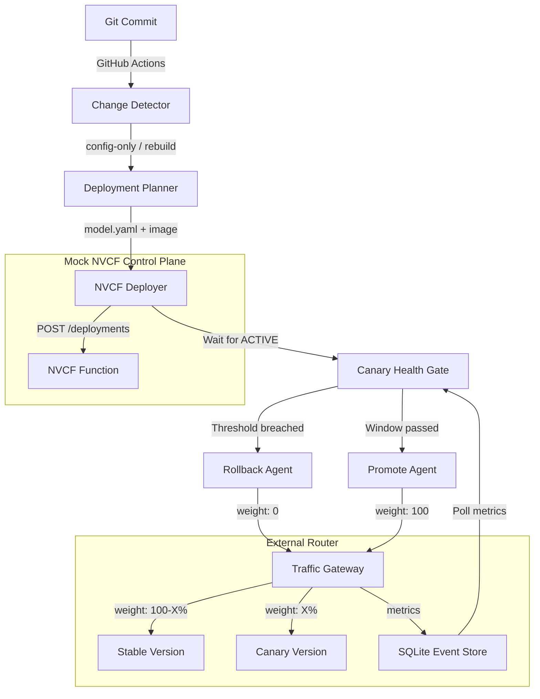

# bhashini-nvcf-agentic

A multi-phase prototype demonstrating the GitOps deployment-automation loop for BHASHINI models.

## Versions

* **v1**: A CPU-only, $0 local prototype. Uses a mock NVCF control plane and a local SQLite-backed canary router. (Completed in main branch)
* **v2 (Current)**: Production-like, internet-facing architecture. Uses a DigitalOcean Droplet for the edge (Kong API Gateway, Prometheus, Grafana, TimescaleDB) and **Google Cloud Platform (GCP Cloud Run)** as the active compute provider.
* **v3 (Planned)**: Full multi-cloud abstraction. AWS/Azure/NVCF providers remain stubs or future adapters until credentials and target platforms are available.

## v1 Architecture (Local Prototype)

This prototype highlights an **honest** approach to canary deployments on cloud providers that lack native traffic-splitting APIs (like NVCF). 



## Local Quick Start (v1)

This project requires Python 3.12+.

```bash
# 1. Install dependencies
python -m venv .venv
source .venv/bin/activate  # On Windows: .\.venv\Scripts\activate
pip install -r model_server/requirements.txt
pip install -r requirements.txt

# 2. Start mock services in background
uvicorn mock_nvcf.app:app --port 8000 &
uvicorn router.gateway:app --port 8001 &

# 3. Run orchestrator (full deploy pipeline)
python pipeline/orchestrator.py --mode full
```

## Repo Structure

- `models/`: Declarative config (`model.yaml`) for each model.
- `mock_nvcf/`: FastAPI mock of the NVCF REST API.
- `router/`: v1 FastAPI traffic router plus the shared deployment event persistence layer.
- `pipeline/`: Agents for diff detection, planning, and deployment.
- `model_server/`: Actual translation model server.
- `.agents/skills/`: The Antigravity skills that defined this architecture.

## v2 Architecture (Production Edge & GCP Compute)

For version two, we transition from a local mock environment to a production-ready, internet-facing distributed architecture.

```mermaid
graph TD
    Client((Client App)) -->|api.contentfor.me| Edge[Kong API Gateway]
    
    subgraph DigitalOcean Droplet (The Edge & Control Plane)
      Edge
      Prometheus[(Prometheus TSDB)]
      Grafana[Grafana Dashboards]
      
      Edge -->|Metrics| Prometheus
      Grafana -->|Query| Prometheus
    end
    
    subgraph Multi-Cloud Compute Layer
      GCP[GCP Vertex AI / Cloud Run]
      AWS[AWS SageMaker]
      NVCF[NVIDIA Cloud Functions]
    end
    
    Edge -->|Weight: 90%| GCP
    Edge -.->|Weight: 10% (Canary)| GCP
    
    subgraph GitHub Actions (CI/CD Pipeline)
      CD[Change Detector] --> Planner[Deployment Planner]
      Planner --> Adapter[Cloud Provider Adapter Layer]
      Adapter -->|API| GCP
      
      Gate[Canary Health Gate] -->|Query Metrics| Prometheus
      Gate -->|Update Routes| Edge
    end
```

### Key upgrades in v2:
1. **Compute Adapter Pattern**: Unified `CloudProvider` base class with GCP as the active Phase 2 provider; AWS is intentionally a stub.
2. **Production Edge (DigitalOcean)**: Real **Kong API Gateway** handles dynamic 90/10 traffic splitting, completely hiding the backends.
3. **Enterprise Observability**: Real **Prometheus** scrapes network metrics from Kong, and **Grafana** visualizes model performance.
4. **Automated Health Gate**: The `canary_health.py` agent queries Prometheus using PromQL to determine promotion or automatic rollback.

## v2 Operational Notes

- Do not expose Kong Admin (`8001`) or Postgres/Timescale (`5432`) publicly. The Compose file binds them to `127.0.0.1`; use SSH/VPN tunnels for CI or operator access.
- Set `KONG_STABLE_TARGET_URL` before partial canary traffic. Without a stable backend, the GCP provider intentionally refuses 1-99% rollout.
- Set `PROMETHEUS_URL` explicitly for production canary checks. Local/mock mode can omit it and use the v1 router metrics endpoint.
- Set `DATABASE_URL` only where deployment events should be persisted. Local tests leave it unset to avoid writing to a live database.
