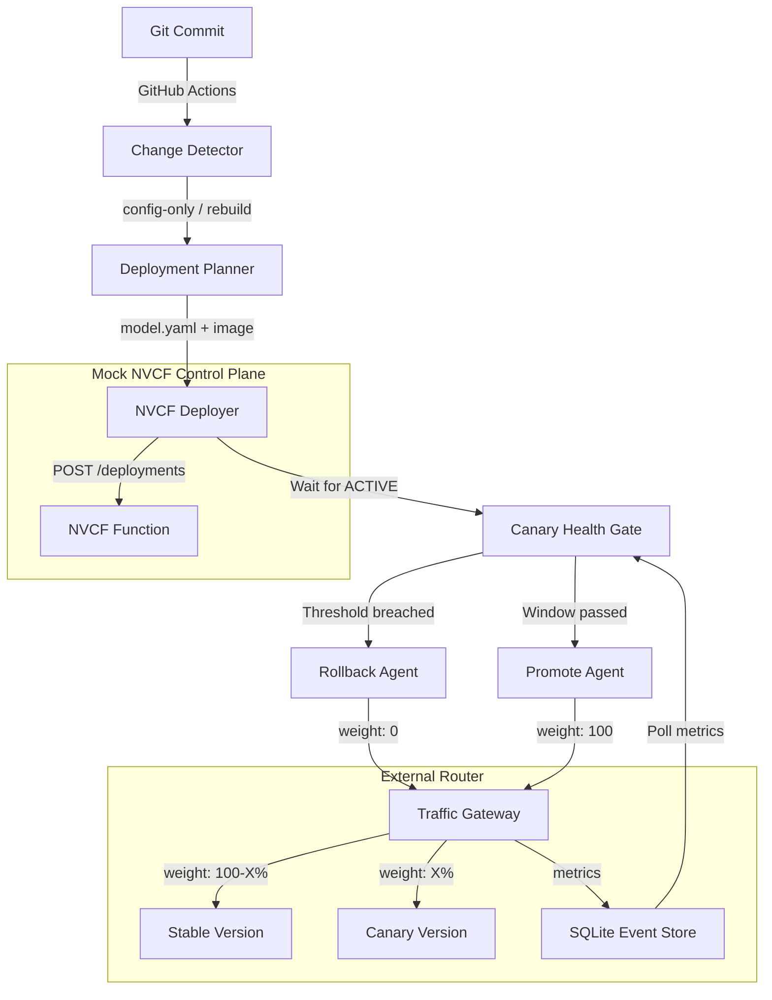

# bhashini-nvcf-agentic

A multi-phase prototype demonstrating the GitOps deployment-automation loop for BHASHINI models.

## Versions

* **v1 (Current)**: A CPU-only, $0 local prototype. Uses a mock NVCF control plane and a local SQLite-backed canary router. 
* **v2 (Upcoming)**: Production-like, internet-facing architecture. Uses a DigitalOcean Droplet for the edge (Kong API Gateway & Prometheus Observability) and **Google Cloud Platform (GCP)** as the actual GPU compute provider.
* **v3 (Planned)**: Full multi-cloud abstraction. Ability to swap between NVCF, GCP, AWS, and Azure seamlessly with minimal manual effort using an Adapter pattern in the deployment pipeline.

## v1 Architecture (Local Prototype)

This prototype highlights an **honest** approach to canary deployments on cloud providers that lack native traffic-splitting APIs (like NVCF). 



## Local Quick Start (v1)

This project requires Python 3.12+.

```bash
# 1. Install dependencies
python -m venv .venv
source .venv/bin/activate  # On Windows: .\.venv\Scripts\activate
pip install -r model_server/requirements.txt
pip install fastapi uvicorn httpx pydantic pyyaml jsonschema gitpython pytest

# 2. Start mock services in background
uvicorn mock_nvcf.app:app --port 8000 &
uvicorn router.gateway:app --port 8001 &

# 3. Run orchestrator (full deploy pipeline)
python pipeline/orchestrator.py --mode full
```

## Repo Structure

- `models/`: Declarative config (`model.yaml`) for each model.
- `mock_nvcf/`: FastAPI mock of the NVCF REST API.
- `router/`: External traffic-split gateway and metrics database.
- `pipeline/`: Agents for diff detection, planning, and deployment.
- `model_server/`: Actual translation model server.
- `.agents/skills/`: The Antigravity skills that defined this architecture.
