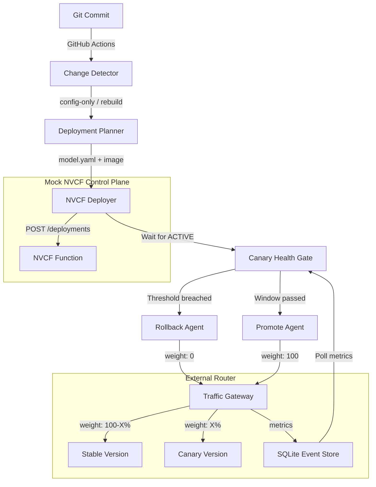

# bhashini-nvcf-agentic

A CPU-only, $0 prototype demonstrating the GitOps deployment-automation loop for BHASHINI models on NVIDIA Cloud Functions (NVCF).

This prototype highlights an **honest** approach to canary deployments on NVCF. Because NVCF does not provide a native traffic-splitting API, this repository includes an external weighted traffic router and a health-gated orchestrator.

## Architecture



## Production Migration

Moving from this prototype to production NVCF involves two changes:
1. **API Client**: In `pipeline/orchestrator.py` and `mock_nvcf/deploy_client.py`, swap the `mock=True` flag to false and supply your `NVCF_API_KEY`. The payload shapes are identical.
2. **Router**: The `router/gateway.py` logic (weighted probability split) should be migrated to an API Gateway like Envoy, Kong, or APISIX running at the edge of your cloud VPC. The health gate (`pipeline/agents/canary_health.py`) will poll your gateway's Prometheus/Datadog metrics instead of the mock SQLite DB.

## Local Quick Start

This project requires Python 3.12+.

```bash
# 1. Install dependencies
python -m venv .venv
source .venv/bin/activate  # On Windows: .\.venv\Scripts\activate
pip install -r model_server/requirements.txt
pip install fastapi uvicorn httpx pydantic pyyaml jsonschema gitpython pytest

# 2. Start mock services in background
uvicorn mock_nvcf.app:app --port 8000 &
uvicorn router.gateway:app --port 8001 &

# 3. Run orchestrator (full deploy pipeline)
python pipeline/orchestrator.py --mode full
```

## Repo Structure

- `models/`: Declarative config (`model.yaml`) for each model.
- `mock_nvcf/`: FastAPI mock of the NVCF REST API.
- `router/`: External traffic-split gateway and metrics database.
- `pipeline/`: Agents for diff detection, planning, and deployment.
- `model_server/`: Actual CTranslate2 model server (meant for Codespaces).
- `.agents/skills/`: The Antigravity skills that defined this architecture.
