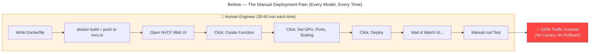
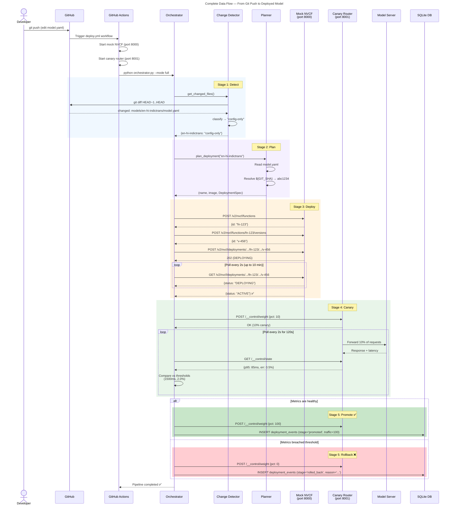

# Bhashini — NVCF Agentic Deployment Platform: Complete Project Notes

> **Purpose of this document**: This file explains the *entire project* — what it is, why it exists, how every piece works, what's built today, and where it goes next. Written so you can explain the project to anyone from a non-technical manager to a senior MLOps engineer.
>
> **Current status**: v2 is the active architecture. v1 sections below are historical/local-prototype context; the production-like path uses Kong, Prometheus/Grafana, TimescaleDB, and GCP Cloud Run.

---

## Table of Contents

1. [The Problem We're Solving](#1-the-problem-were-solving)
2. [The One Critical Discovery](#2-the-one-critical-discovery)
3. [Complete Architecture — Historical Local Prototype (v1)](#3-complete-architecture--historical-local-prototype-v1)
4. [Complete Architecture — Current v2 + Planned v3](#4-complete-architecture--current-v2--planned-v3)
5. [How Every Component Works (The Walkthrough)](#5-how-every-component-works-the-walkthrough)
6. [File-by-File Map](#6-file-by-file-map)
7. [Key Design Decisions & Rationale](#7-key-design-decisions--rationale)
8. [Data Flow — End to End](#8-data-flow--end-to-end)
9. [Technology Stack & Why Each Was Chosen](#9-technology-stack--why-each-was-chosen)
10. [What's Built vs What's Planned](#10-whats-built-vs-whats-planned)
11. [From Prototype to Production — What Changes](#11-from-prototype-to-production--what-changes)
12. [Glossary](#12-glossary)

---

## 1. The Problem We're Solving

### Before This Project (The Manual Nightmare)

Every time the Bhashini team wants to deploy or update an AI model (translation, speech recognition, text-to-speech), an engineer has to:

1. **Build** a Docker image with the model inside it
2. **Push** the image to NVIDIA's container registry (`nvcr.io`)
3. **Open** the NVCF web UI and manually create or update a "function"
4. **Configure** GPU type, port mappings, scaling limits, and concurrency — all by clicking in a UI
5. **Deploy** and stare at the screen until the status flips to "ACTIVE"
6. **Manually test** the endpoint with `curl` or Postman
7. **Hope nothing breaks** — because the new model gets 100% of traffic instantly, with zero safety net



### Pain Points

| Problem | Impact | Why It Matters |
|---------|--------|----------------|
| 30-60 min of manual UI work per deploy | Doesn't scale as model count grows (10+ models) | Engineers waste hours clicking instead of building |
| No connection to git history | Can't audit "what's running" or "who changed what" | Compliance risk, debugging nightmare |
| Configuration lives in the UI, not in code | Config drifts — GPU type, concurrency settings differ from what was intended | Reproducibility is impossible |
| No canary / staged rollout | A bad model instantly gets 100% traffic | Users experience broken translations immediately |
| No automated rollback | Recovery requires manually undoing changes in the UI | Downtime can stretch to hours |
| No quality gate (e.g., WER check) | ASR quality regressions reach production undetected | End users get worse results without anyone knowing |

### After This Project (The Goal)

**Zero-touch deployment**: A `git push` to a config file triggers an automated pipeline that deploys, monitors, and either promotes or rolls back a new model version — all without human intervention.

---

## 2. The One Critical Discovery

> ⚠️ **This is the single most important insight in the entire project. Read this section carefully.**

### NVCF Does NOT Have Native Canary Traffic Splitting

The original design document assumed NVIDIA Cloud Functions (NVCF) supports setting a `trafficPercentage` on different function versions — e.g., "send 10% of traffic to the new version, 90% to the old one."

**This capability does not exist.**

NVCF has a 3-layer model: **Function → Version → Deployment**. But routing across versions is **availability-based, not weight-based**:

> *"Invocations to this function ID will now be routing to both the new and old versions of the function after this deploy based on function instance availability."*
> — [NVCF Function Management docs](https://docs.nvidia.com/cloud-functions/user-guide/latest/cloud-function/function-management.html)

There is **no `trafficPercentage` or `weight` field** anywhere in the NVCF deployment API. The only documented fields in `deploymentSpecifications` are: `gpu`, `instanceType`, `backend`, `minInstances`, `maxInstances`, `maxRequestConcurrency`, `regions`, `clusters`, `configuration`, `attributes`.

### What This Means for Us

The original spec's canary stages (`PATCH /versions/{vid} → trafficPercentage: 10/100/0`) are **fictional API calls**. They would return a 404 on the real NVCF API.

### Our Solution: Build the Router Ourselves

Real canary on NVCF = **you build and operate an external router** — your own gateway that holds two function endpoints (stable and canary) and splits requests by a settable weight. The weighting logic lives in *your* code, not in NVCF.

> **This is not a workaround — it's actually how any real NVCF canary deployment must work.** The router we built is the most production-relevant piece of the entire project.

---

## 3. Complete Architecture — Historical Local Prototype (v1)

The v1 local prototype is preserved for context and offline testing. The active v2 deployment path is described in the next section.

```mermaid
---
title: "COMPLETE ARCHITECTURE — HISTORICAL LOCAL STATE (v1 Prototype)"
---
flowchart TB
    %% ===== SOURCE OF TRUTH =====
    subgraph GIT["📁 Git Repository (Source of Truth)"]
        direction TB
        MY["models/en-hi-indictrans/<br/><b>model.yaml</b><br/>────────────────<br/>schema_version: 1.0<br/>name: en-hi-indictrans<br/>type: hf-mt<br/>image: ghcr.io/.../en-hi-indictrans:${GIT_SHA}<br/>gpu: CPU<br/>scaling: min=1, max=2, concurrency=4<br/>canary: enabled=true, weight=10%<br/>rollback_on: p95>1500ms, err>2%"]
        SCHEMA["pipeline/schemas/<br/><b>model_yaml_v1.json</b><br/>JSON Schema validation"]
        MY ---|"validated by"| SCHEMA
    end

    %% ===== CI/CD TRIGGER =====
    subgraph CICD["⚙️ CI/CD Layer (GitHub Actions)"]
        direction TB
        PUSH["git push to<br/>models/** or pipeline/**"]
        DEPLOY_WF[".github/workflows/<br/><b>deploy.yml</b><br/>Runs on push"]
        HOTFIX_WF[".github/workflows/<br/><b>hotfix_deploy.yml</b><br/>Manual dispatch<br/>skip_canary option"]
        PUSH --> DEPLOY_WF
    end

    %% ===== PIPELINE STAGES =====
    subgraph PIPELINE["🔄 Pipeline Orchestrator (pipeline/orchestrator.py)"]
        direction TB

        subgraph S1["Stage 1: Change Detector"]
            CD["<b>change_detector.py</b><br/>git diff HEAD~1..HEAD<br/>→ classify each model:<br/>'config-only' vs 'rebuild' vs 'ci-only'"]
        end

        subgraph S2["Stage 2: Deployment Planner"]
            DP["<b>deployment_planner.py</b><br/>Reads model.yaml<br/>Resolves ${GIT_SHA} in image tag<br/>Produces DeploymentSpec<br/>(gpu, min/max instances, concurrency)"]
        end

        subgraph S3["Stage 3: Deploy Agent"]
            DA["<b>NVCFProvider / nvcf_deploy.py</b><br/>1. get_or_create_function(name)<br/>2. create_version(fn_id, image)<br/>3. deploy(fn_id, v_id, spec)<br/>4. poll_deployment until ACTIVE"]
        end

        subgraph S4["Stage 4: Canary Health Gate"]
            CH["<b>canary_health.py</b><br/>Set router weight → 10%<br/>Poll metrics every 2s for 120s<br/>Compare against thresholds:<br/>• p95_latency_ms > 1500 → rollback<br/>• error_rate_pct > 2.0 → rollback<br/>• wer_delta_pct > 5.0 → rollback"]
        end

        subgraph S5["Stage 5: Promote / Rollback"]
            PR["<b>promote.py</b><br/>✅ Healthy → set weight 100% + log event<br/>❌ Degraded → set weight 0% + log event + alert"]
        end

        CD --> DP --> DA --> CH --> PR
    end

    %% ===== MOCK NVCF =====
    subgraph MOCK["🖥️ Mock NVCF Server (mock_nvcf/app.py, port 8000)"]
        direction TB
        FN["POST /v2/nvcf/functions<br/>→ Create Function"]
        VER["POST /v2/nvcf/functions/{fid}/versions<br/>→ Create Version"]
        DEP["POST /v2/nvcf/deployments/functions/{fid}/versions/{vid}<br/>→ Start Deployment (returns 202)"]
        POLL["GET /v2/nvcf/deployments/functions/{fid}/versions/{vid}<br/>→ Poll Status: DEPLOYING → ACTIVE"]
        ADMIN["POST /__admin/advance/...<br/>→ Test hook: force status"]

        FN --> VER --> DEP --> POLL
        
        NOTE_MOCK["⚠️ DELIBERATELY no traffic-weight field<br/>Faithful to real NVCF API limitation"]
    end

    %% ===== CANARY ROUTER =====
    subgraph ROUTER["🔀 Canary Router (router/gateway.py, port 8001)"]
        direction TB
        GW["FastAPI Proxy<br/>────────────────<br/>Holds: stable_url + canary_url<br/>canary_weight: 0–100%<br/>────────────────<br/>For each request:<br/>random(1,100) ≤ weight? → canary<br/>else → stable"]
        CTRL_W["POST /__control/weight<br/>→ Set canary percentage"]
        CTRL_S["GET /__control/state<br/>→ Return p95, error_rate"]
        METRICS["Rolling Metrics (last 100 req)<br/>• canary_latencies (deque)<br/>• canary_errors (deque)"]

        GW --> METRICS
    end

    %% ===== DATABASE =====
    subgraph DB["💾 Deployment Events (router/db.py → SQLite)"]
        EVENTS["deployment_events table<br/>────────────────<br/>ts, model_name, git_sha,<br/>image_tag, fn_id, version_id,<br/>stage, traffic_pct,<br/>rollback_reason,<br/>p95_latency_ms, error_rate, wer_delta"]
    end

    %% ===== MODEL SERVER =====
    subgraph MODEL["🤖 Model Server (model_server/server.py)"]
        SRV["FastAPI Server<br/>────────────────<br/>Helsinki-NLP/opus-mt-en-hi<br/>(200M params, CPU inference)<br/>────────────────<br/>POST /infer → translation<br/>GET /health → status ok"]
        DOCKER["Dockerfile<br/>python:3.11-slim<br/>uvicorn on port 8000"]
    end

    %% ===== PROVIDER ABSTRACTION =====
    subgraph PROVIDERS["🔌 Provider Abstraction Layer"]
        BASE["CloudProvider (ABC)<br/>────────────────<br/>deploy_model()<br/>get_deployment_status()<br/>get_health_metrics()<br/>route_traffic()<br/>promote()<br/>rollback()<br/>delete_deployment()"]
        NVCF_P["NVCFProvider<br/>(mock or real)"]
        GCP_P["GCPProvider<br/>(Cloud Run)"]
        AWS_P["AWSProvider<br/>(Stub)"]

        BASE --> NVCF_P
        BASE --> GCP_P
        BASE --> AWS_P
    end

    %% ===== TEST SUITE =====
    subgraph TESTS["🧪 Test Suite (13 tests, all passing)"]
        T1["test_validate.py (3)<br/>Schema validation"]
        T2["test_change_detector.py (1)<br/>Git diff classification"]
        T3["test_mock_nvcf.py (3)<br/>Full NVCF lifecycle + no-traffic-split check"]
        T4["test_nvcf_deploy.py (2)<br/>Deploy flow + timeout"]
        T5["test_canary_health.py (2)<br/>Good metrics → promote / Bad → rollback"]
        T6["test_router.py (2)<br/>Weight setting + validation"]
    end

    %% ===== CONNECTIONS =====
    GIT -->|"trigger"| CICD
    CICD -->|"runs"| PIPELINE
    HOTFIX_WF -->|"bypass detector,<br/>skip canary"| PIPELINE
    DA -->|"HTTP calls"| MOCK
    CH -->|"poll metrics"| ROUTER
    PR -->|"set weight"| ROUTER
    PR -->|"log event"| DB
    ROUTER -->|"proxy to"| MODEL
    NVCF_P -->|"wraps"| MOCK

    %% ===== STYLES =====
    classDef source fill:#e3f2fd,stroke:#1565c0,color:#000
    classDef pipeline fill:#f3e5f5,stroke:#7b1fa2,color:#000
    classDef mock fill:#fff3e0,stroke:#ef6c00,color:#000
    classDef router fill:#e8f5e9,stroke:#2e7d32,color:#000
    classDef db fill:#fce4ec,stroke:#c62828,color:#000
    classDef model fill:#f1f8e9,stroke:#558b2f,color:#000
    classDef test fill:#e0f7fa,stroke:#00838f,color:#000
    classDef provider fill:#ede7f6,stroke:#4527a0,color:#000

    class GIT source
    class PIPELINE pipeline
    class MOCK mock
    class ROUTER router
    class DB db
    class MODEL model
    class TESTS test
    class PROVIDERS provider
```



---

## 4. Complete Architecture — Current v2 + Planned v3

The active v2 path uses a DigitalOcean-hosted Kong/Prometheus/Grafana/Timescale edge and GCP Cloud Run as the compute provider. v3 expands the same provider interface to additional clouds.

```mermaid
---
title: "FAST-FORWARD VISION — Production Platform (v2 Current + v3 Planned)"
---
flowchart TB
    %% ===== CLIENTS =====
    CLIENT["👤 Client Applications<br/>(Bhashini APIs, Dhruva,<br/>Mobile Apps, Web Frontends)"]

    %% ===== EDGE LAYER =====
    subgraph EDGE["🌐 Edge Layer — DigitalOcean Droplet (v2)"]
        direction TB
        NGINX["NGINX Reverse Proxy<br/>────────────────<br/>SSL Termination (Let's Encrypt)<br/>api.contentfor.me → Kong<br/>obs.contentfor.me → Grafana"]
        
        KONG["Kong API Gateway<br/>────────────────<br/>• Weighted traffic splitting<br/>  (90% stable / 10% canary)<br/>• Rate limiting<br/>• Authentication<br/>• Request logging<br/>• Health checks"]

        subgraph OBS["📊 Observability Stack"]
            PROM["Prometheus<br/>Scrapes Kong metrics<br/>every 10s"]
            GRAF["Grafana Dashboards<br/>────────────────<br/>• p95 Latency<br/>• Error Rate<br/>• Request Volume<br/>• Canary vs Stable"]
        end

        NGINX --> KONG
        KONG -->|"metrics"| PROM
        PROM --> GRAF
    end

    %% ===== MULTI-CLOUD COMPUTE =====
    subgraph COMPUTE["☁️ Multi-Cloud Compute Layer (v3 Vision)"]
        direction LR

        subgraph NVCF_CLOUD["NVIDIA Cloud Functions"]
            NVCF_FN["Triton / NIM Functions<br/>GPU inference (A100, L40)<br/>Scale-to-zero"]
        end

        subgraph GCP_CLOUD["Google Cloud Platform"]
            GCP_CR["Cloud Run<br/>CPU/GPU model serving<br/>Auto-scaling"]
            GCP_V["Vertex AI<br/>Managed ML endpoints"]
        end

        subgraph AWS_CLOUD["Amazon Web Services"]
            AWS_SM["SageMaker<br/>Managed model endpoints"]
            AWS_ECS["ECS / Fargate<br/>Container-based serving"]
        end

        subgraph AZURE_CLOUD["Microsoft Azure (v3)"]
            AZURE_ML["Azure ML Endpoints"]
        end
    end

    %% ===== CI/CD PIPELINE =====
    subgraph CICD_PROD["⚙️ CI/CD Pipeline (GitHub Actions)"]
        direction TB

        subgraph DETECT["Stage 1: Detect"]
            CD_P["Change Detector<br/>git diff → manifest"]
        end

        subgraph PLAN["Stage 2: Plan"]
            DP_P["Deployment Planner<br/>model.yaml → DeploymentSpec"]
        end

        subgraph BUILD["Stage 3: Build"]
            BUILD_P["Docker Build<br/>Push to GHCR / nvcr.io / GCR / ECR"]
        end

        subgraph DEPLOY["Stage 4: Deploy"]
            ADAPTER["CloudProvider Adapter<br/>────────────────<br/>Selects correct provider:<br/>NVCF | GCP | AWS | Azure<br/>────────────────<br/>Same interface for all:<br/>deploy_model()<br/>poll_status()<br/>route_traffic()<br/>promote() / rollback()"]
        end

        subgraph GATE["Stage 5: Canary Health Gate"]
            HEALTH["Canary Health Agent<br/>────────────────<br/>Queries Prometheus via PromQL<br/>────────────────<br/>Checks thresholds:<br/>• p95 TTFT<br/>• Error rate<br/>• WER delta (ASR models)<br/>────────────────<br/>Window: configurable (120s–600s)"]
        end

        subgraph DECIDE["Stage 6: Decide"]
            PROMOTE_P["Promote → 100% via Kong"]
            ROLLBACK_P["Rollback → 0% via Kong<br/>+ alert + event log"]
        end

        CD_P --> DP_P --> BUILD_P --> ADAPTER --> HEALTH
        HEALTH -->|"✅ healthy"| PROMOTE_P
        HEALTH -->|"❌ degraded"| ROLLBACK_P
    end

    %% ===== PLATFORM SERVICES (v3 FUTURE) =====
    subgraph PLATFORM["🏗️ Platform Services (v3 Future)"]
        direction TB
        REGISTRY["Model Registry<br/>(MLflow or ULCA ulca-model-api)"]
        AUDIT["Audit Log<br/>────────────────<br/>Who deployed what, when,<br/>approval chain, rollback history"]
        DASHBOARD["Deployment Dashboard<br/>────────────────<br/>Web UI for:<br/>• Deploy history timeline<br/>• Version comparison<br/>• One-click rollback<br/>• Environment promotion<br/>(staging → prod)"]
        APPROVALS["Release Approvals<br/>────────────────<br/>Required sign-off before<br/>production deployment"]
        LLM_AGENT["🤖 LLM Rollback Triage Agent<br/>────────────────<br/>On failed canary:<br/>• Reads metrics + diffs + logs<br/>• Produces root-cause hypothesis<br/>• Drafts incident note<br/>• Suggests threshold adjustments<br/>────────────────<br/>THIS is what makes it<br/>genuinely 'agentic'"]
    end

    %% ===== GIT SOURCE =====
    subgraph GIT_P["📁 Git Repository"]
        YAML_P["models/*/<b>model.yaml</b><br/>Declarative config per model<br/>────────────────<br/>Supports model types:<br/>hf-mt | triton | vllm | sglang"]
        JSON_SCHEMA["JSON Schema Validation"]
    end

    %% ===== DATA STORES =====
    subgraph STORES["💾 Data Layer"]
        TSDB["TimescaleDB<br/>────────────────<br/>deployment_events table<br/>OTel collector ingestion<br/>Time-series metrics"]
        OTEL["OpenTelemetry Collector<br/>────────────────<br/>Distributed traces<br/>from all model servers"]
    end

    %% ===== CONNECTIONS =====
    CLIENT -->|"HTTPS"| NGINX

    KONG -->|"90% stable"| COMPUTE
    KONG -->|"10% canary"| COMPUTE

    GIT_P -->|"push triggers"| CICD_PROD
    ADAPTER -->|"provider-specific API"| COMPUTE
    HEALTH -->|"PromQL queries"| PROM
    PROMOTE_P -->|"update routes"| KONG
    ROLLBACK_P -->|"update routes"| KONG
    PROMOTE_P -->|"log"| TSDB
    ROLLBACK_P -->|"log"| TSDB

    COMPUTE -->|"traces"| OTEL
    OTEL --> TSDB
    TSDB --> LLM_AGENT
    LLM_AGENT -->|"recommendations"| DASHBOARD

    %% ===== STYLES =====
    classDef edge fill:#e3f2fd,stroke:#1565c0,color:#000
    classDef compute fill:#fff3e0,stroke:#ef6c00,color:#000
    classDef cicd fill:#f3e5f5,stroke:#7b1fa2,color:#000
    classDef platform fill:#e8f5e9,stroke:#2e7d32,color:#000
    classDef store fill:#fce4ec,stroke:#c62828,color:#000
    classDef future fill:#fff9c4,stroke:#f9a825,color:#000

    class EDGE edge
    class COMPUTE compute
    class CICD_PROD cicd
    class PLATFORM future
    class STORES store
```



### Evolution Roadmap

```mermaid
---
title: "Project Evolution — v1 → v2 → v3"
---
timeline
    title Bhashini Agentic Deployment Platform — Version Timeline

    section v1 — Local Prototype (COMPLETED)
        Phase 0 — Environment Setup : GitHub repo, Codespaces, free cloud accounts
        Phase 1 — model.yaml + Schema : Declarative config, JSON Schema validation
        Phase 2 — Mock NVCF Server : Faithful 3-layer API mock (no traffic-split!)
        Phase 3 — Model Server : Helsinki-NLP opus-mt-en-hi on CPU in Docker
        Phase 4 — Core Pipeline Agents : Change Detector → Planner → Deployer → Poll ACTIVE
        Phase 5 — Canary Router + Health : External FastAPI router, metric-gated canary
        Phase 6 — Promote/Rollback + CI : GitHub Actions workflows, hotfix dispatch
        Phase 7 — Tests + Verification : 13 tests passing, full pipeline verified

    section v2 — Production Edge (CURRENT)
        Kong API Gateway : DigitalOcean Droplet, SSL, weighted routing
        Prometheus + Grafana : Real observability stack
        GCP Cloud Run : Real compute backend (CPU model serving)
        Provider Abstraction : CloudProvider base class + NVCF/GCP/AWS adapters
        Prometheus-backed Health Gate : canary_health.py queries PromQL

    section v3 — Full Platform (PLANNED)
        Multi-Cloud Compute : Swap NVCF/GCP/AWS/Azure seamlessly
        Web Dashboard UI : Deploy history, version comparison, one-click rollback
        Model Registry Integration : MLflow or ULCA ulca-model-api
        Release Approvals : Required sign-off for production
        Audit Trail : Full deployment history with blame
        LLM Triage Agent : Genuinely agentic rollback intelligence
        Environment Promotion : Staging → Production pipeline
```



---

## 5. How Every Component Works (The Walkthrough)

### 5.1 The Config File: `model.yaml` (The Source of Truth)

**What it is**: A single YAML file per model that declares *everything* about how that model should be deployed.

**Why it matters**: This is the heart of the GitOps approach. Instead of configuring deployments by clicking in a UI (which is unreproducible and un-auditable), every setting lives in a version-controlled file. `git log` tells you exactly who changed what, when, and why.

```yaml
schema_version: "1.0"
name: en-hi-indictrans          # Maps to NVCF function name
type: hf-mt                     # Model type (Hugging Face Machine Translation)
image: ghcr.io/muzammilafroz/en-hi-indictrans:${GIT_SHA}  # Resolves at deploy time
gpu:
  type: CPU                     # CPU for prototype; would be "L40" or "A100" in prod
  count: 0
ports:
  http: 8000                    # Inference endpoint port
scaling:
  min_instances: 1              # Scale-to-zero supported in real NVCF
  max_instances: 2
  concurrency: 4                # Max concurrent requests per instance
canary:
  enabled: true
  initial_traffic_pct: 10       # Start with 10% traffic on the new version
  promote_after_seconds: 120    # Watch for 2 minutes
  rollback_on:                  # Automatic rollback thresholds
    p95_latency_ms: 1500        # If p95 latency exceeds 1.5 seconds
    error_rate_pct: 2.0         # If more than 2% of requests fail
    wer_delta_pct: 5.0          # If Word Error Rate degrades by >5% (ASR models)
smoke_test:
  input_fixture: tests/fixtures/hello.txt
  max_latency_ms: 2000
```

**Validated by**: `pipeline/schemas/model_yaml_v1.json` — a JSON Schema that enforces required fields, correct types, and valid enum values (`hf-mt`, `triton`, `vllm`, `sglang`).

### 5.2 The Pipeline Orchestrator (The Brain)

**File**: `pipeline/orchestrator.py`

**What it does**: Coordinates the entire deployment lifecycle. It's the `main()` of the pipeline.

**Flow**:
1. Loads environment configuration (`.env`)
2. Selects the cloud provider (`MOCK_NVCF` / `GCP` / `AWS` / `NVCF`)
3. Runs the Change Detector to identify which models changed and how
4. For each changed model: Plan → Deploy → Canary → Promote/Rollback
5. Supports **hotfix mode**: bypasses change detection, can skip canary

**Three execution modes**:
- `--mode full`: Complete pipeline (detect → plan → deploy → canary → promote)
- `--mode config-only`: Skip Docker rebuild (for scaling/canary-only changes)
- `--mode smoke-only`: Just run the smoke test

### 5.3 Stage 1: Change Detector

**File**: `pipeline/change_detector.py`

**What it does**: Runs `git diff HEAD~1..HEAD` and classifies each changed file:

| Changed File Pattern | Classification | Result |
|---|---|---|
| `models/<name>/model.yaml` only | `config-only` | Skip Docker build, just re-deploy with new config |
| `models/<name>/Dockerfile` or weights | `rebuild` | Full Docker build + push + deploy |
| `pipeline/**` or `.github/**` | `ci-only` | No model deploy needed |

**Why this matters**: Config-only changes (e.g., tweaking `max_instances` from 2 to 4) should NOT trigger a 15-minute Docker build. This optimization saves significant CI time.

### 5.4 Stage 2: Deployment Planner

**File**: `pipeline/deployment_planner.py`

**What it does**:
1. Reads `model.yaml` for the changed model
2. Resolves `${GIT_SHA}` in the image tag to the actual commit hash
3. Translates the YAML config into an NVCF `DeploymentSpec` (a Pydantic model matching the real NVCF API shape)

**Output**: `(name, image, DeploymentSpec)` tuple ready for the deploy agent.

### 5.5 Stage 3: Deploy Agent (NVCF Provider)

**File**: `pipeline/providers/nvcf.py` (wraps `mock_nvcf/deploy_client.py`)

**What it does** — follows the real NVCF 3-layer model exactly:

```
Step 1: POST /v2/nvcf/functions          → Get or create a Function (stable identity)
Step 2: POST /v2/nvcf/functions/{fid}/versions  → Create a Version (image + config)
Step 3: POST /v2/nvcf/deployments/functions/{fid}/versions/{vid}  → Start Deployment (allocate GPU/CPU)
Step 4: GET  /v2/nvcf/deployments/functions/{fid}/versions/{vid}  → Poll until ACTIVE (up to 10 min)
```

**Key design**: The deploy client (`NVCFDeployClient`) works identically against the mock server and the real NVIDIA API. The **only difference** is the base URL and auth token:
- Mock: `http://localhost:8000` + `Bearer mock-token`
- Real: `https://api.ngc.nvidia.com` + `Bearer <your NGC API key>`

### 5.6 The Mock NVCF Server

**File**: `mock_nvcf/app.py`

**What it is**: A FastAPI server that faithfully mimics the real NVCF REST API. In-memory stores track functions, versions, and deployments.

**Why we built it**: There is NO free tier to deploy your own NVCF function. NVCF billing requires prepurchased NVIDIA credits or a DGX Cloud subscription.

**What it does faithfully**:
- 3-layer Function → Version → Deployment model
- Separate deployment endpoint path (`/v2/nvcf/deployments/functions/{fid}/versions/{vid}`)
- Status transitions: `DEPLOYING → ACTIVE` (after configurable delay)
- Authorization header requirement
- **Deliberately NO traffic-weight field** (honest to real NVCF limitation)

**Test hook**: `POST /__admin/advance/...` to force status changes instantly (for tests).

### 5.7 Stage 4: Canary Router + Health Gate

**Router file**: `router/gateway.py`

**This is the project's most important component** — it's the piece NVCF is missing, and it's exactly what a real NVCF deployment needs.

**How it works**:
- Holds two URLs: `stable_url` and `canary_url`
- Maintains a `canary_weight` (0–100)
- For each incoming request:
  - Generate `random(1, 100)`
  - If ≤ `canary_weight` → forward to canary
  - Else → forward to stable
- Records latency and error status for canary requests in a rolling buffer (last 100)
- Exposes control endpoints:
  - `POST /__control/weight` → set canary percentage
  - `GET /__control/state` → return computed p95 latency and error rate

**Health Gate file**: `pipeline/agents/canary_health.py`

**How it works**:
1. Sets router to initial canary weight (e.g., 10%)
2. Polls `/__control/state` every 2 seconds for `promote_after_seconds` (e.g., 120s)
3. At each poll, checks:
   - p95 latency against threshold
   - Error rate against threshold
4. If ANY threshold is breached → **immediate rollback** (weight → 0%)
5. If the full window passes without breach → **promote** (weight → 100%)

**v2 enhancement**: Can also pull metrics from Prometheus via PromQL (`fetch_metrics_from_prometheus`), replacing the local router metrics.

### 5.8 Stage 5: Promote / Rollback

**File**: `pipeline/agents/promote.py`

**Promote**:
1. Set router weight to 100% (new version gets all traffic)
2. Log a `promoted` event to the SQLite database

**Rollback**:
1. Set router weight to 0% (all traffic returns to stable)
2. Log a `rolled_back` event with the reason (which threshold was breached)

### 5.9 Deployment Events Database

**File**: `router/db.py`

**What it stores** (in SQLite, standing in for TimescaleDB):
```
deployment_events:
  ts              → UTC timestamp
  model_name      → which model
  git_sha         → which commit
  image_tag       → which Docker image
  fn_id           → NVCF function ID
  version_id      → NVCF version ID
  stage           → "promoted" or "rolled_back"
  traffic_pct     → 0 or 100
  rollback_reason → why it was rolled back (nullable)
  p95_latency_ms  → latency at decision time
  error_rate      → error rate at decision time
  wer_delta       → WER delta at decision time (nullable)
```

### 5.10 Provider Abstraction Layer

**Files**: `pipeline/providers/base.py`, `nvcf.py`, `gcp.py`, `aws.py`

**The Adapter Pattern**: Every cloud provider implements the same `CloudProvider` abstract base class. The orchestrator calls **only** the interface methods — it never knows whether it's talking to NVCF, GCP, or AWS.

```python
class CloudProvider(ABC):
    deploy_model(model_id, image_uri, config) → (fn_id, version_id)
    get_deployment_status(fn_id, version_id) → "DEPLOYING" | "ACTIVE" | "FAILED"
    get_health_metrics(fn_id, version_id) → {p95_latency_ms, error_rate_pct}
    route_traffic(fn_id, version_id, weight) → None
    promote(fn_id, version_id, model_name, image_tag) → None
    rollback(fn_id, version_id, model_name, image_tag, reason) → None
    delete_deployment(fn_id, version_id) → None
    close() → None
```

**Why this exists**: Switching from NVCF mock to real NVCF is a config change (`CLOUD_PROVIDER=NVCF` in `.env`). Switching to GCP Cloud Run is also a config change (`CLOUD_PROVIDER=GCP`). No code changes in the orchestrator.

### 5.11 The Model Server

**File**: `model_server/server.py`

**What it is**: A real, working translation model server using Helsinki-NLP/opus-mt-en-hi (fallback for the larger IndicTrans2 model that requires Linux).

**Endpoints**:
- `POST /infer` → accepts `{text, src_lang, tgt_lang}`, returns `{translation: "..."}`
- `GET /health` → returns `{status: "ok"}`

**Docker**: Built with `python:3.11-slim`, runs via `uvicorn` on port 8000.

---

## 6. File-by-File Map

```
bhashini-nvcf-agentic/
├── models/
│   └── en-hi-indictrans/
│       └── model.yaml                 ← THE source of truth for this model's deployment
│
├── pipeline/
│   ├── __init__.py
│   ├── change_detector.py             ← Stage 1: git diff → classify changes
│   ├── deployment_planner.py          ← Stage 2: model.yaml → DeploymentSpec
│   ├── nvcf_deploy.py                 ← Stage 3 (legacy): direct NVCF deploy
│   ├── orchestrator.py                ← THE BRAIN: coordinates all stages
│   ├── validate.py                    ← Validates model.yaml against JSON Schema
│   ├── agents/
│   │   ├── canary_health.py           ← Stage 4: metric-gated canary health check
│   │   └── promote.py                 ← Stage 5: promote (100%) or rollback (0%)
│   ├── providers/
│   │   ├── __init__.py                ← Factory: get_provider("MOCK_NVCF" | "GCP" | ...)
│   │   ├── base.py                    ← Abstract CloudProvider interface
│   │   ├── nvcf.py                    ← NVCF implementation (mock + real)
│   │   ├── gcp.py                     ← GCP Cloud Run implementation
│   │   └── aws.py                     ← AWS stub
│   └── schemas/
│       ├── model_yaml_v1.json         ← JSON Schema for model.yaml validation
│       └── nvcf_models.py             ← Pydantic models (shared API contract)
│
├── mock_nvcf/
│   ├── __init__.py
│   ├── app.py                         ← FastAPI mock of NVCF REST API
│   ├── deploy_client.py               ← HTTP client for NVCF API (works with mock or real)
│   └── models.py                      ← Re-exports from pipeline/schemas/nvcf_models.py
│
├── router/
│   ├── __init__.py
│   ├── gateway.py                     ← THE CANARY ROUTER (the NVCF-missing piece)
│   └── db.py                          ← SQLite deployment_events logger
│
├── model_server/
│   ├── server.py                      ← Real translation model (opus-mt-en-hi)
│   ├── Dockerfile                     ← Container for model serving
│   └── requirements.txt
│
├── infrastructure/
│   ├── docker-compose.yml             ← Kong + Prometheus + Grafana (v2 edge stack)
│   ├── nginx.conf                     ← SSL termination for api.contentfor.me
│   └── prometheus.yml                 ← Scrape config for Kong metrics
│
├── tests/
│   ├── test_validate.py               ← 3 tests: valid YAML, missing field, bad enum
│   ├── test_change_detector.py        ← 1 test: change classification logic
│   ├── test_mock_nvcf.py              ← 3 tests: auth, full lifecycle, no-traffic-split
│   ├── test_nvcf_deploy.py            ← 2 tests: deploy flow, timeout handling
│   ├── test_canary_health.py          ← 2 tests: healthy promote, bad rollback
│   ├── test_router.py                 ← 2 tests: weight setting, validation
│   ├── inject_metrics.py              ← Helper to force healthy/degraded metrics
│   └── fixtures/
│       └── (test input data)
│
├── .github/workflows/
│   ├── deploy.yml                     ← Auto-triggered on push to models/** or pipeline/**
│   └── hotfix_deploy.yml              ← Manual dispatch with skip_canary option
│
├── .env.example                       ← Template for environment variables
├── .gitignore                         ← Ignores .env, *.db, .venv, model weights
├── ACTIONABLE_PLAN.md                 ← The research-grounded implementation plan
├── README.md                          ← Project overview with architecture diagrams
├── verification_report.md             ← Full test and integration verification results
└── deployment_events.db               ← SQLite database (auto-created on first run)
```

---

## 7. Key Design Decisions & Rationale

### Decision 1: Build an External Router Instead of Faking NVCF Traffic Splitting

| Consideration | Choice |
|---|---|
| **Problem** | NVCF has no native canary traffic-splitting API |
| **Option A** | Fake a `trafficPercentage` field and pretend it works |
| **Option B** | Build a real external router that does weighted splitting |
| **We chose** | **Option B** — because this is exactly how real NVCF canary must work |
| **Benefit** | The router is production-relevant code, not throwaway prototype code |

### Decision 2: GitOps — model.yaml as the Single Source of Truth

| Consideration | Choice |
|---|---|
| **Problem** | Configuration lives in the NVCF UI (unreproducible, no history) |
| **Solution** | Every deployment setting lives in `model.yaml` in git |
| **Benefit** | `git log` = audit trail, `git diff` = what changed, `git revert` = rollback |
| **Inspiration** | Argo CD, Flux CD — the standard GitOps pattern for Kubernetes |

### Decision 3: Provider Abstraction (Adapter Pattern)

| Consideration | Choice |
|---|---|
| **Problem** | Need to support mock NVCF now, real NVCF later, GCP/AWS in future |
| **Solution** | Abstract `CloudProvider` base class with provider-specific implementations |
| **Benefit** | Switching providers = one environment variable change, zero code changes |
| **Inspiration** | Same pattern used by Terraform, Kubernetes CSI drivers |

### Decision 4: Mock NVCF Faithful to Real API (Including Limitations)

| Consideration | Choice |
|---|---|
| **Problem** | Can't access real NVCF (no free tier) |
| **Option A** | Mock with a simple key-value store |
| **Option B** | Build a mock that faithfully replicates the real 3-layer API shape |
| **We chose** | **Option B** — same endpoints, same status transitions, same limitations |
| **Benefit** | Code written against the mock works against real NVCF with zero changes |

### Decision 5: Deterministic Pipeline (Not LLM-Driven)

| Consideration | Choice |
|---|---|
| **Problem** | The word "agentic" implies LLM-driven autonomous reasoning |
| **Reality** | Stages 1–6 are deterministic sequential logic (no LLM involved) |
| **Our position** | The pipeline is a **deterministic deployment controller** — calling it "agentic" is aspirational |
| **Future plan** | Add a genuinely agentic layer (LLM rollback triage) in v3, earning the word honestly |

---

## 8. Data Flow — End to End



---

## 9. Technology Stack & Why Each Was Chosen

| Technology | Used For | Why This One |
|---|---|---|
| **Python 3.11+** | All pipeline code | Type hints, async/await, ecosystem (ML libraries) |
| **FastAPI** | Mock NVCF, Router, Model Server | Async, Pydantic validation, auto-docs, high performance |
| **Pydantic** | Data models / API contracts | Type-safe, auto-serialization, matches NVCF API shape |
| **httpx** | HTTP client (async) | Modern async HTTP, test-friendly `MockTransport` |
| **uvicorn** | ASGI server | Production-grade, fast, works with FastAPI |
| **GitPython** | Change detection | Programmatic `git diff` without shelling out |
| **jsonschema** | model.yaml validation | Industry standard, JSON Schema draft 2020-12 |
| **PyYAML** | Parse model.yaml | Standard Python YAML parser |
| **SQLite** | Deployment events | Zero-config, stands in for TimescaleDB, same schema |
| **Docker** | Model containerization | Industry standard, works with NVCF/GCP/AWS |
| **GitHub Actions** | CI/CD | Free for public repos, native GitHub integration |
| **pytest** | Testing | Standard Python test framework, async support |
| **Kong** (v2) | API Gateway | Enterprise-grade, weighted routing, Prometheus metrics |
| **Prometheus** (v2) | Metrics collection | Time-series DB, PromQL, Kong integration |
| **Grafana** (v2) | Dashboards | Visualization, alerting, Prometheus data source |
| **NGINX** (v2) | SSL termination | Reverse proxy, Let's Encrypt, subdomain routing |

---

## 10. What's Built vs What's Planned

| Component | v1 (Built ✅) | v2 (In Progress 🔨) | v3 (Planned 📋) |
|---|---|---|---|
| Declarative model.yaml | ✅ | ✅ | ✅ |
| JSON Schema validation | ✅ | ✅ | ✅ |
| Change Detector (git diff) | ✅ | ✅ | ✅ |
| Deployment Planner | ✅ | ✅ | ✅ |
| Mock NVCF Server | ✅ | ✅ (kept for testing) | ✅ |
| Canary Router | ✅ (FastAPI) | 🔨 (Kong replaces) | ✅ |
| NVCF Deploy Agent | ✅ (mock) | 🔨 (real API) | ✅ |
| Health Gate (local metrics) | ✅ | — | — |
| Health Gate (Prometheus) | — | 🔨 | ✅ |
| Promote / Rollback | ✅ | ✅ | ✅ |
| Deployment Events DB | ✅ (SQLite) | 🔨 (TimescaleDB) | ✅ |
| Model Server | ✅ (opus-mt-en-hi) | 🔨 (IndicTrans2) | ✅ |
| GitHub Actions CI | ✅ | ✅ | ✅ |
| Hotfix Workflow | ✅ | ✅ | ✅ |
| Provider Abstraction | ✅ (NVCF, GCP, AWS stubs) | 🔨 (GCP real) | 📋 (all) |
| Kong Gateway | — | 🔨 | ✅ |
| Prometheus + Grafana | — | 🔨 | ✅ |
| SSL / Domain | — | 🔨 | ✅ |
| Multi-cloud deploy | — | — | 📋 |
| Web Dashboard UI | — | — | 📋 |
| Model Registry | — | — | 📋 |
| Release Approvals | — | — | 📋 |
| Audit Trail | — | — | 📋 |
| LLM Triage Agent | — | — | 📋 |
| Environment Promotion | — | — | 📋 |
| WER-gated ASR deploy | — | — | 📋 |

---

## 11. From Prototype to Production — What Changes

This is the "migration guide" — what exactly needs to change to go from mock to real.

| Layer | Prototype (v1) | Production | Change Required |
|---|---|---|---|
| NVCF Server | `mock_nvcf/app.py` on `localhost:8000` | `https://api.ngc.nvidia.com` | Change `NVCFDeployClient(mock=False)` and set `NVCF_API_KEY` env var |
| Auth Token | `Bearer mock-token` | `Bearer <NGC API Key>` | Set `NVCF_API_KEY` in Codespaces secrets |
| Container Registry | GHCR (`ghcr.io`) | nvcr.io (NVIDIA) or GHCR | Change image prefix in `model.yaml` + set `NVCR_TOKEN` |
| GPU | `CPU` | `L40`, `A100`, etc. | Change `gpu.type` in `model.yaml` |
| Canary Router | Local FastAPI router | Kong API Gateway on DigitalOcean | Already abstracted behind `route_traffic()` in provider |
| Metrics | Rolling deque in router memory | Prometheus + OTel → TimescaleDB | Already have `fetch_metrics_from_prometheus()` |
| Events Database | SQLite file | TimescaleDB | Same schema, different connection string |
| Model | Helsinki-NLP/opus-mt-en-hi (fallback) | ai4bharat/indictrans2-en-indic-dist-200M | Better model, same `/infer` interface |
| Compute | Local Docker / HF Spaces | NVCF GPU instances | Just the mock→real switch above |

**The key insight**: ~90% of the code is reusable. The mock→real transition is a base-URL + auth-header change.

---

## 12. Glossary

| Term | Meaning |
|---|---|
| **NVCF** | NVIDIA Cloud Functions — serverless GPU compute platform |
| **Function** | Top-level NVCF entity — a stable identifier for a model endpoint |
| **Version** | A specific image + config attached to a function |
| **Deployment** | GPU/CPU instances allocated to serve a specific version |
| **Canary** | A deployment pattern: send a small % of traffic to the new version first, monitor, then promote or rollback |
| **GitOps** | The desired state of infrastructure lives in git; a controller reconciles reality to match |
| **Progressive Delivery** | Gradual rollout with automated validation (canary is one form) |
| **p95 Latency (TTFT)** | 95th percentile response time — the worst-case experience for 95% of users |
| **WER** | Word Error Rate — measures ASR (speech recognition) accuracy |
| **WER Delta** | Change in WER between old and new model versions |
| **Argo Rollouts / Flagger** | Kubernetes tools for progressive delivery (can't run on NVCF) |
| **KServe** | Kubernetes-native model serving with canary traffic % |
| **Kong** | Open-source API gateway with weighted routing and Prometheus metrics |
| **OTel** | OpenTelemetry — standardized observability (traces, metrics, logs) |
| **TimescaleDB** | PostgreSQL extension for time-series data |
| **IndicTrans2** | AI4Bharat's multilingual translation model (the target Bhashini model) |
| **CTranslate2** | Inference engine for efficient CPU/GPU model serving |
| **Adapter Pattern** | Design pattern where a unified interface hides provider-specific implementations |
| **GHCR** | GitHub Container Registry (free Docker image hosting) |
| **nvcr.io** | NVIDIA Container Registry (where NVCF pulls images from) |
| **Dhruva** | Bhashini's public API for ASR/NMT/TTS inference |
| **ULCA** | Universal Language Contribution API — Bhashini's data and model management portal |

---

> **Bottom line**: This project takes a painful, manual, error-prone model deployment process and replaces it with a git-triggered, automated, canary-safe pipeline. The prototype honestly addresses the biggest surprise (NVCF lacks traffic splitting) by building the missing router, and the provider abstraction means the same pipeline works across NVCF, GCP, and AWS. Phase 1 is complete and verified. The road to production is a configuration change, not a rewrite.
